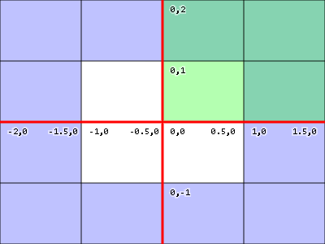
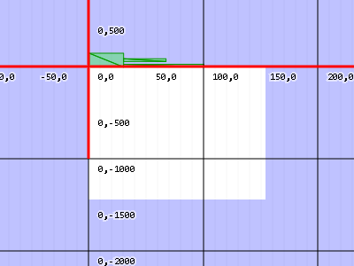
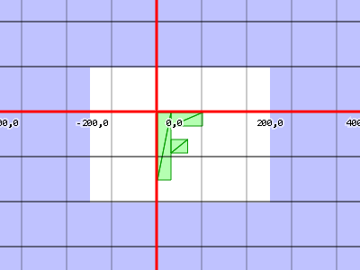
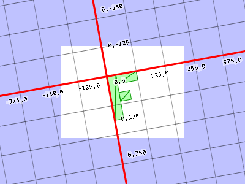
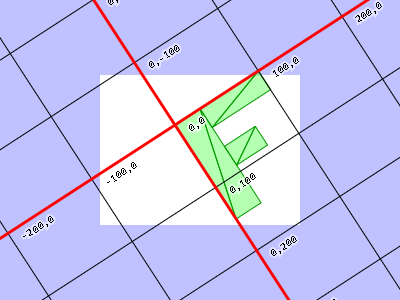

# WebGL 2D Matrices

For 2D we use a 3x3 matrix. A 3x3 matrix is like a grid with 9 boxes?


|      |      |     |
|------|------|-----|
|1.0   |2.0   |3.0  |
|4.0   |5.0   |6.0  |
|7.0   |8.0   |9.0  |

To do the math we multiply the position down the columns of the matrix and add up the results. Our positions only have 2 values, x and y, but to do this math we need 3 values so we`ll use 1 for the third value.

In this case our result would be
``` 
newX = x * 1.0 +	    
       y * 4.0 +		         
       1 * 7.0	 		 

newY = x * 2.0 +	    
  	   y * 5.0 + 		   
       1 * 8.0	  		    

extra = x * 3.0 +
     	y * 6.0 +
	  	1 * 9.0	

```

Let's assume we have a translation. We'll call the amount we want to translate by `tx`and `ty`. Let's make a matrix like this


|      |      |     |
|------|------|-----|
|1.0   |0.0   |0.0  |
|0.0   |1.0   |0.0  |
|tx    |ty    |9.0  |

And now check it out
```
newX = x * 1.0 +	    
       y * 0.0 +		         
       1 * tx	 		 

newY = x * 0.0 +	    
  	   y * 1.0 + 		   
       1 * ty	  		    

extra = x * 0.0 +
        y * 0.0 +
	  	1 * 1.0
```
**REMEMBER:** your algebra, we can delete any place that multiplies by zero. Multiplying by 1 effectively does nothing so let's simplify to see what's happening
```
newX = x + tx;
newY = y + ty;
```
Similarly let's do rotation. Like we pointed out in the rotation post we just need the sine and cosine of the angle at which we want to rotate, so
```
s = Math.sin(angleToRotateInRadians);
c = Math.cos(angleToRotateInRadians);
```
An we build a matrix like this

|      |      |     |
|------|------|-----|
|c     |-s    |0.0  |
|s     |c     |0.0  |
|0.0   |0.0   |1.0  |

Applying the matrix we get this
```
newX = x * c +	    
       y * s +		         
       1 * 0.0	 		 

newY = x * -s +	    
  	   y * c + 		   
       1 * 0.0	  		    

extra = x * 0.0 +
        y * 0.0 +
	  	1 * 1.0
```
Simplifying we get
```
newX = x * c + y * s;
newY = x * -s + y * c;
```
And lastly scale. We'll call our 2 scale factors `sx` and `sy`

And we build a matrix like this

|      |      |     |
|------|------|-----|
|sx    |0.0   |0.0  |
|0.0   |sy    |0.0  |
|0.0   |0.0   |1.0  |

Applying the matrix we this 
```
newX = x * sx +	    
       y * 0.0 +		         
       1 * 0.0	 		 

newY = x * 0.0 +	    
  	   y * sy + 		   
       1 * 0.0	  		    

extra = x * 0.0 +
        y * 0.0 +
	  	1 * 1.0
```
which simplified is
```
newX = x * sx;
newY = y * sy;
```
Let's assume we have a function, `m3.multiply`, that takes two matrices, multiplies them and returns the result
```
var m3 = {
  multiply: function(a, b) {
    var a00 = a[0 * 3 + 0];
    var a01 = a[0 * 3 + 1];
    var a02 = a[0 * 3 + 2];
    var a10 = a[1 * 3 + 0];
    var a11 = a[1 * 3 + 1];
    var a12 = a[1 * 3 + 2];
    var a20 = a[2 * 3 + 0];
    var a21 = a[2 * 3 + 1];
    var a22 = a[2 * 3 + 2];
    var b00 = b[0 * 3 + 0];
    var b01 = b[0 * 3 + 1];
    var b02 = b[0 * 3 + 2];
    var b10 = b[1 * 3 + 0];
    var b11 = b[1 * 3 + 1];
    var b12 = b[1 * 3 + 2];
    var b20 = b[2 * 3 + 0];
    var b21 = b[2 * 3 + 1];
    var b22 = b[2 * 3 + 2];
 
    return [
      b00 * a00 + b01 * a10 + b02 * a20,
      b00 * a01 + b01 * a11 + b02 * a21,
      b00 * a02 + b01 * a12 + b02 * a22,
      b10 * a00 + b11 * a10 + b12 * a20,
      b10 * a01 + b11 * a11 + b12 * a21,
      b10 * a02 + b11 * a12 + b12 * a22,
      b20 * a00 + b21 * a10 + b22 * a20,
      b20 * a01 + b21 * a11 + b22 * a21,
      b20 * a02 + b21 * a12 + b22 * a22,
    ];
  }
}
```
To make things clearer let's make functions to build matrices for translation, rotation and scale.
```
var m3 = {
  translation: function(tx, ty) {
    return [
      1, 0, 0,
      0, 1, 0,
      tx, ty, 1,
    ];
  },
 
  rotation: function(angleInRadians) {
    var c = Math.cos(angleInRadians);
    var s = Math.sin(angleInRadians);
    return [
      c,-s, 0,
      s, c, 0,
      0, 0, 1,
    ];
  },
 
  scaling: function(sx, sy) {
    return [
      sx, 0, 0,
      0, sy, 0,
      0, 0, 1,
    ];
  },
};
```
Now let's change our shader. The old shader looked like this
```
<script id="vertex-shader-2d" type="x-shader/x-vertex">
attribute vec2 a_position;
 
uniform vec2 u_resolution;
uniform vec2 u_translation;
uniform vec2 u_rotation;
uniform vec2 u_scale;
 
void main() {
  // Scale the position
  vec2 scaledPosition = a_position * u_scale;
 
  // Rotate the position
  vec2 rotatedPosition = vec2(
     scaledPosition.x * u_rotation.y + scaledPosition.y * u_rotation.x,
     scaledPosition.y * u_rotation.y - scaledPosition.x * u_rotation.x);
 
  // Add in the translation.
  vec2 position = rotatedPosition + u_translation;
  ...
```
Our new shader will be much simpler
```
<script id="vertex-shader-2d" type="x-shader/x-vertex">
attribute vec2 a_position;
 
uniform vec2 u_resolution;
uniform mat3 u_matrix;
 
void main() {
  // Multiply the position by the matrix.
  vec2 position = (u_matrix * vec3(a_position, 1)).xy;
  ...
```
And here's how we use it
```
// Draw the scene.
function drawScene() {
 
  ,,,
 
  // Compute the matrices
  var translationMatrix = m3.translation(translation[0], translation[1]);
  var rotationMatrix = m3.rotation(angleInRadians);
  var scaleMatrix = m3.scaling(scale[0], scale[1]);
 
  // Multiply the matrices.
  var matrix = m3.multiply(translationMatrix, rotationMatrix);
  matrix = m3.multiply(matrix, scaleMatrix);
 
  // Set the matrix.
  gl.uniformMatrix3fv(matrixLocation, false, matrix);
 
  // Draw the rectangle.
  gl.drawArrays(gl.TRIANGLES, 0, 18);
}
```
Being able to apply matrices like this is especially important for hierarchical animation like arms on a body, moons on a planet around a sun, or a branches on a tree. For a simple example of hierarchical animation lets draw our 'F' 5 times but each time lets start with the matrix from the previous 'F'.
```
// Draw the scene.
function drawScene() {
  // Clear the canvas.
  gl.clear(gl.COLOR_BUFFER_BIT);
 
  // Compute the matrices
  var translationMatrix = m3.translation(translation[0], translation[1]);
  var rotationMatrix = m3.rotation(angleInRadians);
  var scaleMatrix = m3.scaling(scale[0], scale[1]);
 
  // Starting Matrix.
  var matrix = m3.identity();
 
  for (var i = 0; i < 5; ++i) {
    // Multiply the matrices.
    matrix = m3.multiply(matrix, translationMatrix);
    matrix = m3.multiply(matrix, rotationMatrix);
    matrix = m3.multiply(matrix, scaleMatrix);
 
    // Set the matrix.
    gl.uniformMatrix3fv(matrixLocation, false, matrix);
 
    // Draw the geometry.
    gl.drawArrays(gl.TRIANGLES, 0, 18);
  }
}
```
To do this we introduced the function, `m3.identity`, that makes an identity matrix. An identity matrix is a matrix that effectively represents 1.0 so that if you multiply by the identity nothing happens. Just like `X * 1 = X` so too `matrixX * identity = matrixX`

Here's the code to make an identity matrix.
```
var m3 = {
  identity function() {
    return [
      1, 0, 0,
      0, 1, 0,
      0, 0, 1,
    ];
  },
 
  ...
```
But now,  because we can do matrix math and we can choose the order that transforms are applied we can move the origin.
```
// make a matrix that will move the origin of the 'F' to its center.
var moveOriginMatrix = m3.translation(-50, -75);
...
 
// Multiply the matrices.
var matrix = m3.multiply(translationMatrix, rotationMatrix);
matrix = m3.multiply(matrix, scaleMatrix);
matrix = m3.multiply(matrix, moveOriginMatrix);
```

If you go back to the first article **fundamental.md** you might remember we have code in the shader to convert from pixels to clip space that looks like this.
```
...
// convert the rectangle from pixels to 0.0 to 1.0
vec2 zeroToOne = position / u_resolution;
 
// convert from 0->1 to 0->2
vec2 zeroToTwo = zeroToOne * 2.0;
 
// convert from 0->2 to -1->+1 (clip space)
vec2 clipSpace = zeroToTwo - 1.0;
 
gl_Position = vec4(clipSpace * vec2(1, -1), 0, 1);
```
If you look at each of those steps in turn, the first step, "convert from pixels to 0.0 to 1.0", is really a scale operation. The second is also a scale operation. The next is a translation and the very last scales Y by -1. We can actually do that all in the matrix we pass into the shader. We could make 2 scale matrices, one to scale by 1.0/resolution, another to scale by 2.0, a 3rd to translate by -1.0, -1.0 and a 4th to scale Y by -1 then multiply them all together but instead, because the math is simple, we'll just make a function that makes a 'projection' matrix for a given resolution directly.
```
var m3 = {
  projection: function(width, height) {
    // Note: This matrix flips the Y axis so that 0 is at the top.
    return [
      2 / width, 0, 0,
      0, -2 / height, 0,
      -1, 1, 1
    ];
  },
 
  ...
```
Now we can simplify the shader even more. Here's the entire new vertex shader.
```
<script id="vertex-shader-2d" type="x-shader/x-vertex">
attribute vec2 a_position;
 
uniform mat3 u_matrix;
 
void main() {
  // Multiply the position by the matrix.
  gl_Position = vec4((u_matrix * vec3(a_position, 1)).xy, 0, 1);
}
</script>
```
And in JavaScript we need to multiply by the projection matrix
```
// Draw the scene.
function drawScene() {
  ...
 
  // Compute the matrices
  var projectionMatrix = m3.projection(
      gl.canvas.clientWidth, gl.canvas.clientHeight);
 
  ...
 
  // Multiply the matrices.
  var matrix = m3.multiply(projectionMatrix, translationMatrix);
  matrix = m3.multiply(matrix, rotationMatrix);
  matrix = m3.multiply(matrix, scaleMatrix);
 
  ...
}
```
We also removed the code that set the resolution.

While it's common to generate various matrices and separately multiply them together it's also common to just multiply them as we go. Effectively we could functions like this
```
var m3 = {
 
  ...
 
  translate: function(m, tx, ty) {
    return m3.multiply(m, m3.translation(tx, ty));
  },
 
  rotate: function(m, angleInRadians) {
    return m3.multiply(m, m3.rotation(angleInRadians));
  },
 
  scale: function(m, sx, sy) {
    return m3.multiply(m, m3.scaling(sx, sy));
  },
 
  ...
 
};
```
This would let us change 7 lines of matrix code above to just 4 lines like this
```
// Compute the matrix
var matrix = m3.projection(gl.canvas.clientWidth, gl.canvas.clientHeight);
matrix = m3.translate(matrix, translation[0], translation[1]);
matrix = m3.rotate(matrix, angleInRadians);
matrix = m3.scale(matrix, scale[0], scale[1]);
```

The other way to look at matrices is reading from left to right. In that case each matrix changes the *spaces* represented by the canvas. The canvas starts with represeting clip space (-1 to +1) in each direction. Each applied from left to right changes the space represented by the canvas.

**Step 1:** no matrix(or the identity matrix)


The black (or white I am seeing black:) is the canvas. Blue is outside the canvas. We're in clip space. Positions passed in need to be in clip space.

**See the animations in:** https://webglfundamentals.org/webgl/lessons/webgl-2d-matrices.html

**Step 2:** `matrix = m3.projection(gl.canvas.clientWidth, gl.canvas.clientHeight);`



We'e now in pixel space. `X = 0` to `400`, `Y = 0` to `300` with `0,0`at the top left. Positions passed using this matrix in need to be in pixel space. The falsh you see is when the space flip from positive `Y = up` to positive `Y = down`

**Step 3:** `matrix = m3.translate(matrix, tx, ty);`



The origin has now been moved to `tx, ty(150, 100)`. The space has moved.

**Step 4:** `matrix = m3.rotate(matrix, rotationInRadians);`



The space has been rotated around `tx`, `ty`

**Step 5:** `matrix = m3.scale(matrix, sx, sy);`



The previously rotated spaces with its center at `tx`, `ty` has been scaled `2` in `x`, `1.5` in `y`

In the shader we then do `gl_Position = matrix * position;`. The `position` values are effectively in this final space.

**Playlist explaining more about Matrix:** https://www.youtube.com/watch?v=kjBOesZCoqc&list=PLZHQObOWTQDPD3MizzM2xVFitgF8hE_ab

## What are `clientWidth`and `clientHeight`?

Up until this point whenever I referred to the canvas's dimensions I used `canvas.width`and `canvas.height` but above when I called `m3.projection` I instead used `canvas.clientWidth` and `canvas.clientHeight`, because projection matrices are concerned with how to take clip space (-1 to +1 in each dimension) and convert it back to pixels. But, in the browser, there are 2 types of pixels we are dealing with. One isw the number of pixels in the canvas itself. So for example a canvas defined like this.

`<canvas width="400" height="300"></canvas>`

or one defined like this
```
var canvas = document.createElement("canvas");
canvas.width = 400;
canvas.height = 300;
```
both contain an image 400 pixels wide by 300 pixels tall. But, that size is separate from what size the browser actually displays that 400x300 pixel canvas. CSS defines what size the canvas is displayed. For example if we made a canvas like this.
```
<style>
canvas {
    width: 100vw;
    height: 100vh;
}
</style>
...
<canvas width="400" height="300"></canvas>
```
The canvas will be displayed whatever size its container is. That's likely not 400x300.

Here are two examples that set the canvas' CSS diplay size to 100% so the canvas is stretched out to fill the page. The fist one uses `canvas.width` and `canvas.height`, so this example it will gets distorted.

In the second example we use `canvas.clientWidth`and `canvas.clientHeight`. `canvas.clientWidth` and `canvas.clientHeight` report the size the canvas is actually being displayed by the browser so in this case, even though the canvas still only has 400x300 pixels since we're defining our apect ratio based on the size the canvas is being displayed the geometry always looks correct.

Most apps that allow their canvases to be resized try to make the `canvas.width` and `canvas.height` match the `canvas.clientWidth` and `canvas.clientHeight` because they want there to be one pixel in the canvas for each pixel displayed by the browser. But, as it was explained, that's not the only option. That means, in almost all cases, it's more technically correct to compute a projection matrix's aspect ratio using `canvas.clientHeight` and `canvas.clientWidth`. 