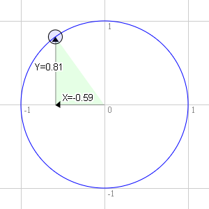
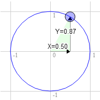
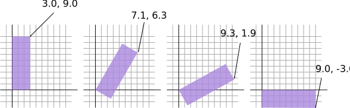
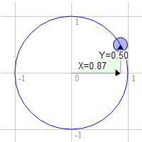

# WebGL 2D Rotation

A circle has a radius. The radius of a circle is the distance from the center of the circle to the edge. A unit circle is a circle with a radius of 1.0. 



In the original image, you can drag a blue handle that is blinked, around the circle. Changing the X and Y positions. Using the 2D translation's sample, we will change:
```
<script id="vertex-shader-2d" type="x-shader/x-vertex">
attribute vec2 a_position;
 
uniform vec2 u_resolution;
uniform vec2 u_translation;
uniform vec2 u_rotation; // New Line
 
void main() {
  // Rotate the position
  vec2 rotatedPosition = vec2(      // New Line
     a_position.x * u_rotation.y + a_position.y * u_rotation.x,
     a_position.y * u_rotation.y - a_position.x * u_rotation.x);
 
  // Add in the translation.
  vec2 position = rotatedPosition + u_translation;  // Line Changed
```
And we update the JavaScript so that we can pass those 2 values in.
```
...
 
var rotationLocation = gl.getUniformLocation(program, "u_rotation"); // New Line
 
...
 
var rotation = [0, 1]; // New Line
 
...
 
// Draw the scene.
function drawScene() {
 
    ...
 
    // Set the translation.
    gl.uniform2fv(translationLocation, translation);
 
    // Set the rotation.                    
    gl.uniform2fv(rotationLocation, rotation);  // New Line
 
    // Draw the geometry.
    var primitiveType = gl.TRIANGLES;
    var offset = 0;
    var count = 18;  // 6 triangles in the 'F', 3 points per triangle
    gl.drawArrays(primitiveType, offset, count);
}
```
See the result in **FCircleUnit.html**.

For this work, there is this math:
```
rotateX = a_position.x * u_rotation.y + a_position.y * u_rotation.x;
rotateY = a_position.y * u_rotation.y - a_position.x * u_rotation.x;
```
Let's say you have a rectangle and you want to rotate it. Before you start rotating it the top right corner is at `3.0`, `9.0`. Let's pick a point on the unit circle 30 degrees clockwise from 12 o'clock.



The position on the circle there is `0.50` and `0.87`
```
3.0 * 0.87 + 9.0 * 0.50 = 7.1
9.0 * 0.87 - 3.0 * 0.50 = 6.3
```
Tha's exactly where we need it to be



The same for 60 degrees clockwise



The position on the circle there is `0.87` and `0.50`
```
3.0 * 0.50 + 9.0 * 0.87 = 9.3
9.0 * 0.50 - 3.0 * 0.87 = 1.9
```
You can see that as we rotate that point clockwise to the right the X value gets bigger and the Y gets smaller. If we kept going past 90 degress X would start getting smaller again and Y would start getting bigger. That pattern gives us rotation.

There's another name for the points on a unit circle. They're called the sine and cosine. So for any given angle we can just look up the sine and cosine like this.
```
function printSineAndCosineForAnAngle(angleInDegrees) {
    var angleInRadians = angleInDegrees * Math.PI / 180;
    var s = Math.sin(angleInRadians);
    var c = Math.cos(angleInRadians);
    console.log("s = " + s + " c = " + c);
}
```
If you copy and paste the code into your JavaScript console and type `printSineAndCosineForAngle(30)` you see it prints `s = 0.49 c = 0.87` (note: I rounded off the numbers)

If you put it all together you can rotate your geometry to any angle you desire. Just set the rotation to the sine and cosine of the angle you want to rotate to.
```
...
var angleInRadians = angleInDegrees * Math.PI / 180;
rotation[0] = Math.sin(angleInRadians);
rotation[1] = Math.cos(angleInRadians);
```
See **FAngle.html**, in this example we don't use the circle unit, just a slider with the angle to rotate the geometry.

## Radians

Radians are a unit of measurement used with circles, rotation and angles. Just like we can measure distance in inches, yards, meters, etc we can measure angles in degrees or radians.

You're probably aware that math with metric measurements is easier than math with imperial measurements. To go from inches to feet we divide by 12. To go from inches to yards we divide by 36. To go from millimeters to centimeters we multiply by 10. To go from millimeters to meters we multiply by 1000. 

Radians vs degrees are similar. Degrees make the math hard. Radians make the math easy. There are 360 degrees in a circle but there are only 2π radians. So a full turn is 2π radians. A half turn is 1π radian. A 1/4 turn, ie 90 degrees is 1/2π radians. So if you want to rotate something 90 degrees just use `Math.PI * 0.5`. If you want to rotate it 45 degrees use `Math.PI * 0.25` etc.

**TIP:** Nearly all math involving angles, circles or rotation works very simple if you start thinking in radians. Use radians, not degrees except in UI displays.