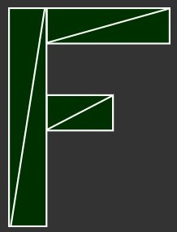

# WebGL 2D Translation

Translation is math name that basically means "to move" something. 

First let's make some variables to hold the translation, width, height and color of the rectangle
```
var translation = [0, 0];
var width = 100;
var height = 30;
var color = [Math.random(), Math.random(), Math.random(), 1];
```
Then let's make a function to re-draw everything. We can call this function after we update the translation.
```
// Draw a the scene.
function drawScene() {
    webglUtils.resizeCanvasToDisplaySize(gl.canvas);

    // Tell WebGL how to convert from clip space to pixels
    gl.viewport(0, 0, gl.canvas.width, gl.canvas.height);

    // Clear the canvas
    gl.clear(gl.COLOR_BUFFER_BIT);

    // Tell it to use our program (pair of shaders)
    gl.useProgram(program);

    // Turn on the attribute
    gl.enableVertexAttribArray(positionLocation);

    // Bind the position buffer
    gl.bindBuffer(gl.ARRAY_BUFFER, positionBuffer);

    // Setup a rectangle
    setRectangle(gl, translation[0], translation[1], width, height);

    // Tell the attribute how to get data out of positionBuffer (ARRAY_BUFFER
    var size = 2;           // 2 components per iteration
    var type = gl.FLOAT     // the data is 32bit floats
    var normalize = false;  // don't normalize the data
    var stride = 0;         // 0 = move forward size * sizeof(type) each iteration to get the next position
    var offset = 0;         // start at the beginning of the buffer
    gl.vertexAttribPointer(
        positionLocation, size, type, normalize, stride, offset);
    
    // set the resolution
    gl.uniform2f(resolutionLocation, gl.canvas.width, gl.canvas.height);

    // set the color
    gl.uniform4fv(colorLocation, color);

    // Draw the rectangle
    var primitiveType = gl.TRIANGLES;
    var offset = 0;
    var count = 6;
    gl.drawArrays(primitiveType, offset, count);
}
```
In **movingARectangle.html**, you can see that there are a couple of slider that will update `tanslation[0]` and `tanslation[1]` and call `drawScene`anytime they change.

Let's say we wanted to draw an "F" that consists of 6 triangles like this



Well, following our current code we'd have to change `setRectangle` to something more like this.
```
// Fill the buffer with the values that define a letter "F".
function setGeometry(gl, x, y) {
  var width = 100;
  var height = 150;
  var thicness = 30;

  gl.bufferData(
      gl.ARRAY_BUFFER,
      new Float32Array([
          // left column
          x, y,
          x + thickness, y,
          x, y + height,
          x, y + height,
          x + thickness, y,
          x + thickness, y + height,

          // top rung
          x + thickness, y,
          x + width, y,
          x + thickness, y + thickness,
          x + thickness, y + thickness,
          x + width, y,
          x + width, y + thickness,

          // middle rung
          x + thickness, y + thickness * 2,
          x + width * 2 / 3, y + thickness * 2,
          x + thickness, y + thickness * 3,
          x + thickness, y + thickness * 3,
          x + width * 2 / 3, y + thickness * 2,
          x + width * 2 / 3, y + thickness * 3,
      ]),
      gl.STATIC_DRAW);
}
```
If we want to draw some very complex geometry with hundreds or thousands of lines we'd have to write some pretty complex code. On top of that, every time we draw JavaScript has to update all the points.

There's a simpler way. Just upload the geometry and do the translation in the shader.

In **f.html**, you can see a new shader and the restructure of the code. Notice `setGeometry`is called only once. It is no longer inside `drawScene`.
