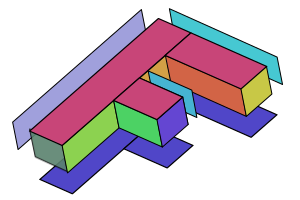
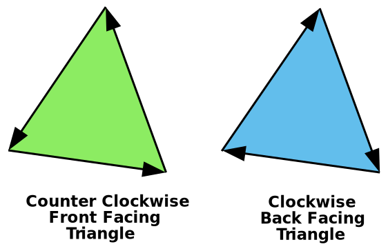

# WebGL 3D Orthographic

The first thing we need to do is change the vertex shader to handle 3D. Here's the old vertex shader.
```
<script id="vertex-shader-2d" type="x-shader/x-vertex">
attribute vec2 a_position;
 
uniform mat3 u_matrix;
 
void main() {
  // Multiply the position by the matrix.
  gl_Position = vec4((u_matrix * vec3(a_position, 1)).xy, 0, 1);
}
</script>
```
And here's the new one
```
<script id="vertex-shader-3d" type="x-shader/x-vertex">
attribute vec4 a_position;
 
uniform mat4 u_matrix;
 
void main() {
  // Multiply the position by the matrix.
  gl_Position = u_matrix * a_position;
}
</script>
```
Just like in 2D we provided `x` and `y`and then set `z` to 1, in 3D we will provide `x`, `y`, and `z` and we need `w` to be 1 but  we can take advantage of the fact for attributes `w` defaults to 1.

Then we need to provide 3D data.
```
 ...
 
  // Tell the attribute how to get data out of positionBuffer (ARRAY_BUFFER)
  var size = 3;          // 3 components per iteration
  var type = gl.FLOAT;   // the data is 32bit floats
  var normalize = false; // don't normalize the data
  var stride = 0;        // 0 = move forward size * sizeof(type) each iteration to get the next position
  var offset = 0;        // start at the beginning of the buffer
  gl.vertexAttribPointer(
      positionAttributeLocation, size, type, normalize, stride, offset);
 
  ...
 
// Fill the current ARRAY_BUFFER buffer
// Fill the buffer with the values that define a letter 'F'.
function setGeometry(gl) {
  gl.bufferData(
      gl.ARRAY_BUFFER,
      new Float32Array([
          // left column
            0,   0,  0,
           30,   0,  0,
            0, 150,  0,
            0, 150,  0,
           30,   0,  0,
           30, 150,  0,
 
          // top rung
           30,   0,  0,
          100,   0,  0,
           30,  30,  0,
           30,  30,  0,
          100,   0,  0,
          100,  30,  0,
 
          // middle rung
           30,  60,  0,
           67,  60,  0,
           30,  90,  0,
           30,  90,  0,
           67,  60,  0,
           67,  90,  0]),
      gl.STATIC_DRAW);
}
```
Next we need to change all the matrix functions from 2D to 3D

Here are the 2D versions of `m3.translation`, `m3.rotation`, and `m3.scaling`
```
var m3 = {
  translation: function translation(tx, ty) {
    return [
      1, 0, 0,
      0, 1, 0,
      tx, ty, 1
    ];
  },
 
  rotation: function rotation(angleInRadians) {
    var c = Math.cos(angleInRadians);
    var s = Math.sin(angleInRadians);
    return [
      c,-s, 0,
      s, c, 0,
      0, 0, 1
    ];
  },
 
  scaling: function scaling(sx, sy) {
    return [
      sx, 0, 0,
      0, sy, 0,
      0, 0, 1
    ];
  },
};
```
And here are the updated 3D versions.
```
var m4 = {
  translation: function(tx, ty, tz) {
    return [
       1,  0,  0,  0,
       0,  1,  0,  0,
       0,  0,  1,  0,
       tx, ty, tz, 1,
    ];
  },
 
  xRotation: function(angleInRadians) {
    var c = Math.cos(angleInRadians);
    var s = Math.sin(angleInRadians);
 
    return [
      1, 0, 0, 0,
      0, c, s, 0,
      0, -s, c, 0,
      0, 0, 0, 1,
    ];
  },
 
  yRotation: function(angleInRadians) {
    var c = Math.cos(angleInRadians);
    var s = Math.sin(angleInRadians);
 
    return [
      c, 0, -s, 0,
      0, 1, 0, 0,
      s, 0, c, 0,
      0, 0, 0, 1,
    ];
  },
 
  zRotation: function(angleInRadians) {
    var c = Math.cos(angleInRadians);
    var s = Math.sin(angleInRadians);
 
    return [
       c, s, 0, 0,
      -s, c, 0, 0,
       0, 0, 1, 0,
       0, 0, 0, 1,
    ];
  },
 
  scaling: function(sx, sy, sz) {
    return [
      sx, 0,  0,  0,
      0, sy,  0,  0,
      0,  0, sz,  0,
      0,  0,  0,  1,
    ];
  },
};
```
Notice we now have 3 rotation functions. We only needed one in 2D as we were effectively only rotating around the Z axis. Now though to do 3D we also want to be able to rotate around the X axis and Y axis as well. You can see from looking at them they are all very similar. If we were to work them out you'd see them simplify just like before
```
Z rotation:
newX = x * c + y * s;
newY = x * -s + y * c;

Y rotation:
newX = x * c + z * s;
newZ = x * -s + z * c;

X rotation:
newY = y * c + z * s;
newZ = y * -s + z * c;

```

**See the illustration of these rotations in:** https://webglfundamentals.org/webgl/lessons/webgl-3d-orthographic.html

Similarly we'll make our simplified functions
```
translate: function(m, tx, ty, tz) {
    return m4.multiply(m, m4.translation(tx, ty, tz));
  },
 
  xRotate: function(m, angleInRadians) {
    return m4.multiply(m, m4.xRotation(angleInRadians));
  },
 
  yRotate: function(m, angleInRadians) {
    return m4.multiply(m, m4.yRotation(angleInRadians));
  },
 
  zRotate: function(m, angleInRadians) {
    return m4.multiply(m, m4.zRotation(angleInRadians));
  },
 
  scale: function(m, sx, sy, sz) {
    return m4.multiply(m, m4.scaling(sx, sy, sz));
  },
```
And we need a 4x4 matrix multiplication function
```
multiply: multiply(a, b) {
    var b00 = b[0 * 4 + 0];
    var b01 = b[0 * 4 + 1];
    var b02 = b[0 * 4 + 2];
    var b03 = b[0 * 4 + 3];
    var b10 = b[1 * 4 + 0];
    var b11 = b[1 * 4 + 1];
    var b12 = b[1 * 4 + 2];
    var b13 = b[1 * 4 + 3];
    var b20 = b[2 * 4 + 0];
    var b21 = b[2 * 4 + 1];
    var b22 = b[2 * 4 + 2];
    var b23 = b[2 * 4 + 3];
    var b30 = b[3 * 4 + 0];
    var b31 = b[3 * 4 + 1];
    var b32 = b[3 * 4 + 2];
    var b33 = b[3 * 4 + 3];
    var a00 = a[0 * 4 + 0];
    var a01 = a[0 * 4 + 1];
    var a02 = a[0 * 4 + 2];
    var a03 = a[0 * 4 + 3];
    var a10 = a[1 * 4 + 0];
    var a11 = a[1 * 4 + 1];
    var a12 = a[1 * 4 + 2];
    var a13 = a[1 * 4 + 3];
    var a20 = a[2 * 4 + 0];
    var a21 = a[2 * 4 + 1];
    var a22 = a[2 * 4 + 2];
    var a23 = a[2 * 4 + 3];
    var a30 = a[3 * 4 + 0];
    var a31 = a[3 * 4 + 1];
    var a32 = a[3 * 4 + 2];
    var a33 = a[3 * 4 + 3];
    dst[ 0] = b00 * a00 + b01 * a10 + b02 * a20 + b03 * a30;
    dst[ 1] = b00 * a01 + b01 * a11 + b02 * a21 + b03 * a31;
    dst[ 2] = b00 * a02 + b01 * a12 + b02 * a22 + b03 * a32;
    dst[ 3] = b00 * a03 + b01 * a13 + b02 * a23 + b03 * a33;
    dst[ 4] = b10 * a00 + b11 * a10 + b12 * a20 + b13 * a30;
    dst[ 5] = b10 * a01 + b11 * a11 + b12 * a21 + b13 * a31;
    dst[ 6] = b10 * a02 + b11 * a12 + b12 * a22 + b13 * a32;
    dst[ 7] = b10 * a03 + b11 * a13 + b12 * a23 + b13 * a33;
    dst[ 8] = b20 * a00 + b21 * a10 + b22 * a20 + b23 * a30;
    dst[ 9] = b20 * a01 + b21 * a11 + b22 * a21 + b23 * a31;
    dst[10] = b20 * a02 + b21 * a12 + b22 * a22 + b23 * a32;
    dst[11] = b20 * a03 + b21 * a13 + b22 * a23 + b23 * a33;
    dst[12] = b30 * a00 + b31 * a10 + b32 * a20 + b33 * a30;
    dst[13] = b30 * a01 + b31 * a11 + b32 * a21 + b33 * a31;
    dst[14] = b30 * a02 + b31 * a12 + b32 * a22 + b33 * a32;
    dst[15] = b30 * a03 + b31 * a13 + b32 * a23 + b33 * a33;
    return dst;
  },
```
We also need to update the projection function. Here's the old one
```
  projection: function (width, height) {
    // Note: This matrix flips the Y axis so 0 is at the top.
    return [
      2 / width, 0, 0,
      0, -2 / height, 0,
      -1, 1, 1
    ];
  },
```
Which converted from pixels to clip space. For our first attempt at expanding it to 3D let's try
```
 projection: function(width, height, depth) {
    // Note: This matrix flips the Y axis so 0 is at the top.
    return [
       2 / width, 0, 0, 0,
       0, -2 / height, 0, 0,
       0, 0, 2 / depth, 0,
      -1, 1, 0, 1,
    ];
  },
```
Just like we needed to convert from pixels to clip space for X and Y, for Z we need to do the same thing. In this case I'm making the Z axis pixel units as well. I'll pass in some value similar to `width` for the `depth` so our space will be 0 to `width` pixels wide, 0 to `height` pixels tall, but for `depth` it will be `-depth / 2` to `+depth / 2`.

Finally we need to update the code that computes the matrix
```
  // Compute the matrix
  var matrix = m4.projection(gl.canvas.clientWidth, gl.canvas.clientHeight, 400);
  matrix = m4.translate(matrix, translation[0], translation[1], translation[2]);
  matrix = m4.xRotate(matrix, rotation[0]);
  matrix = m4.yRotate(matrix, rotation[1]);
  matrix = m4.zRotate(matrix, rotation[2]);
  matrix = m4.scale(matrix, scale[0], scale[1], scale[2]);
 
  // Set the matrix.
  gl.uniformMatrix4fv(matrixLocation, false, matrix);
```
But our 'F' it is not 3D yet. To make it 3D will require a total of 16 rectangles. 
- 3 rectangles on the front;
- 3 rectangles on the back;
- 1 rectangle on the left;
- 4 rectangle on the right;
- 2 on the tops;
- and 3 on the bottoms.



We have to draw more vertices, 96 being more exactly, so
```
// Draw the geometry.
var primitiveType = gl.TRIANGLES;
var offset = 0;
var count = 16 * 6;
gl.drawArrays(primitiveType, offset, count);
```
And let's try coloring each rectangle a different color for this appear more 3D. Here's the new vertex shader
```
<script id="vertex-shader-3d" type="x-shader/x-vertex">
attribute vec4 a_position;
attribute vec4 a_color;
 
uniform mat4 u_matrix;
 
varying vec4 v_color;
 
void main() {
  // Multiply the position by the matrix.
  gl_Position = u_matrix * a_position;
 
  // Pass the color to the fragment shader.
  v_color = a_color;
}
</script>
```
And we need to use that color in the fragment shader
```
<script id="fragment-shader-3d" type="x-shader/x-fragment">
precision mediump float;
 
// Passed in from the vertex shader.
varying vec4 v_color;
 
void main() {
   gl_FragColor = v_color;
}
</script>
```
We need to lookup the attribute location to supply the colors, then setup another buffer and attribute to give it the colors.
```
...
  var colorLocation = gl.getAttribLocation(program, "a_color");
 
  ...
  // Create a buffer for colors.
  var colorBuffer = gl.createBuffer();
  gl.bindBuffer(gl.ARRAY_BUFFER, colorBuffer);
  // Put the colors in the buffer.
  setColors(gl);
 
 
  ...
// Fill the buffer with colors for the 'F'.
 
function setColors(gl) {
  gl.bufferData(
      gl.ARRAY_BUFFER,
      new Uint8Array([
          // left column front
        200,  70, 120,
        200,  70, 120,
        200,  70, 120,
        200,  70, 120,
        200,  70, 120,
        200,  70, 120,
 
          // top rung front
        200,  70, 120,
        200,  70, 120,
        ...
        ...
      gl.STATIC_DRAW);
}
```
Then at render time we need to tell the color attribute how to get colors out of the color buffer
```
// Turn on the color attribute
gl.enableVertexAttribArray(colorLocation);
 
// Bind the color buffer.
gl.bindBuffer(gl.ARRAY_BUFFER, colorBuffer);
 
// Tell the attribute how to get data out of colorBuffer (ARRAY_BUFFER)
var size = 3;                 // 3 components per iteration
var type = gl.UNSIGNED_BYTE;  // the data is 8bit unsigned values
var normalize = true;         // normalize the data (convert from 0-255 to 0-1)
var stride = 0;               // 0 = move forward size * sizeof(type) each iteration to get the next position
var offset = 0;               // start at the beginning of the buffer
gl.vertexAttribPointer(
    colorLocation, size, type, normalize, stride, offset)
```


The **reddish part** is the front of the 'F' but because it's the first part of our data it is drawn first and then the other triangles behind it get drawn after covering it up. For example the **purple part** is actually the back of the 'F'. It gets drawn 2nd because it comes 2nd in our data.

Triangles in WebGL have the concept of front facing and back facing. By default a front facing triangle has its vertices go in a counter clockwise direction. A back facing triangle has its vertices go in a clockwise direction.



WebGL has the ability to draw only forward facing or back facing triangles. We can tur that feature on with `gl.enable(gl.CULL_FACE);`

Well put that in our `drawScene` function. With that feature turned on, WebGL defaults to "culling" back facing triangles. "Culling" in this case is a fancy word for "not drawing".

**NOTE:** as far as WebGL is concerned, whether or not a triangle is considered to be going clockwise or counter clockwise depends on the vertices of that triangle in clip space. In other words, WebGL figures out whether a triangle is front or back, AFTER you've applied math to the vertices in the vertex shader. That means for example a clockwise triangle that is scaled in X by -1 becomes a counter clockwise triangle or a clockwise triangle rotated 180 degrees becomes a counter clockwise triangle. Because we had `CULL_FACE` disabled we can see both clockwise(front) and counter clockwise(back) triangles. Now that we've turned it on, any time a front facing triangle flips around either because of scaling or rotation or for whatever reason, WebGL won't draw it. That's a good thing since as your turn something around in 3D you generally want whichever triangles are facing you to be considered front facing.

Using `CULL_FACE`we are closer but there's still one more problem. Even with all the triangles facing in the correct direction and with the back facing ones being culled we still have places where triangles that should be in the back are being drawn over triangles that should be in front.

Enter the `DEPTH BUFFER`.

A depth buffer, sometimes called a `Z-Buffer`, is a rectangle of depth pixels, one depth pixel for each color pixel used to make the image. As WebGL draws each color pixel it can also draw a depth pixel. It does this based on the values we return from the vertex shader for Z. Just like we had to convert to clip space for X and Y, Z is also in clip space or (-1 to +1). That value is then converted into a depth space value (0 to +1). Before WebGL draws a color pixel it will check the corresponding depth pixel. If the depth value for the pixel it's about to draw is greater than the value of the corresponding depth pixel then WebGL does not draw the new color pixel. Otherwise it draws both the new color pixel with the color from your fragment shader AND it draws the depth pixel with the new depth value. This means, pixels that are behind other pixels won't get drawn.

We can turn on this feature nearly as simply as we turned on culling with `gl.enable(gl.DEPTH_TEST);`

We also need to clear the depth buffer back to 1.0 before we start drawing.
```
// Draw the scene.
  function drawScene() {
    ...
 
    // Clear the canvas AND the depth buffer.
    gl.clear(gl.COLOR_BUFFER_BIT | gl.DEPTH_BUFFER_BIT);
 
    ...
```
One minor thing. In most 3d math libraries there is no projection function to do our conversions from clip space to pixel space. Rather there's usually a function called ortho or orthographic that looks like this
```
var m4 = {
  orthographic: function(left, right, bottom, top, near, far) {
    return [
      2 / (right - left), 0, 0, 0,
      0, 2 / (top - bottom), 0, 0,
      0, 0, 2 / (near - far), 0,
 
      (left + right) / (left - right),
      (bottom + top) / (bottom - top),
      (near + far) / (near - far),
      1,
    ];
  }
```
Unlike our simplified `projection` function above which only had width, height, and depth parameters this more common orthographic projection function we can pass in left, right, bottom, top, near, and far which gives as more flexibility. To use it the same as our original `projection` function we'd call it with
```
var left = 0;
var right = gl.canvas.clientWidth;
var bottom = gl.canvas.clientHeight;
var top = 0;
var near = 400;
var far = -400;
m4.orthographic(left, right, bottom, top, near, far);
```
## Why is the attribute `vec4` but `gl.vertexAttribPointer` size 3

When we use a `vec4` variable we set 3 to it. That '3' in each of those says only to pull 3 values out of the buffer per attribute per iteration of the vertex shader. This works because in the vertex shader WebGL provides defaults for those values you don't supply. The defaults are 0, 0, 0, 1 where `x = 0`, `y = 0`, `z = 0` and `w = 1`. This is why in our old 2D vertex shader we had to explicitly supply the 1. We were passing in x and y and we needed a 1 for z but because the default for z is 0 we had to explicitly supply a 1. For 3D though, even though we don't supply a 'w' it defaults to 1 which is what we need for the matrix math to work.