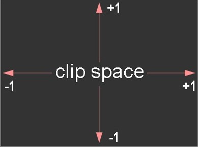

# WebGL
WebGL, it is a code that runs on the GPU on your computer. You provide that code in the form of pairs 
of functions: vertex shader and a fragment shader. They are each written in a very strictly typed C/C++ 
like language called GLSL (GL Shader Language). 

<h1>Vertex Shader</h1>
A vertex shader1s job is to compute vertex positions. Based on the positions the function outputs WebGL 
can the rasterize various kind of primitive including points, lines, or triangles. When rasterizing these 
primitives it calls a second user supplied function called a fragment shader.

<h1>Fragment Shader</h1>
A fragment shader's job is to compute a color for each pivel of primitive currently being drawn.

<h1>Ways a shader can receive data</h1>
Any data you want those functions to have access to must be provided to the GPU. There are four 
ways a shader can receive data:

1. Attributes and Buffers: Buffers are arrays of binary data you upload to GPU. Usually buffers
contain things like positions, normals, texture coordinates, vertex colors, erc although you're
free to put anything you want in them.

Attributes are used to specify how to pull data out of your buffers and provide them to your vertex
shader. For example you might put positions in a buffer as three 32 bits floats per position. You would 
tell a particular attribute which buffer to pull the positions out of, what type of data it should pull out
(3 components 32 bits floating point numbers), what offset in the buffer the positions start, and how many
bytes to get from one position to the next.

Buffers are not random access. Instead a vertex shader is executed a specified number of times. Each time it's
executed the next value from each specified buffer is pulled out and assigned to an attribute.

2. Uniforms: Uniforms are effectively global variables you set before you execute your shader program.

3. Textures: Textures are arrays of data you can randomly access in your shader program. The most common thing to
put in a texture is image data but textures are just data and can just as easily contain something others than colors.

4. Varyings: Varyings are a way for a vertexx shader to pass data to a fragment shader. Depending on what is being 
rendered, points, lines, or triangles, the values set on a varying by a vertex shader will be interpolated while executing 
the frament shader.


<h1>Code example</h1>
WebGL only cares about 2 things: clip space coordinates and colors. A vertex shader which provides the clip space coordinates,
and a fragment shader that provides the color.

Clip space coordinates always go from -1 to +1 no matter what size your canvas is.


Above there is the steps that shows WebGL in its simplest form.

Let's start with a vertex shader

```
// an attribute will receive data from a buffer
 attribute vec4 a_position;

 // all shaders have a main function
 void main() {
    // gl_Position is a special variable a vertex shader
    // is responsible for setting
    gl_Position = a_position;
 }
```

When executed, if the entire things was written in JavaScript instead of GLSL you could imagine it would be used like this

```
// *** PSEUDO CODE!! ***
 var positionBuffer = [
    0, 0, 0, 0,
    0, 0.5, 0, 0,
    0.7, 0, 0, 0,
 ];
 var attributes = {};
 var gl_Position;

 drawArrays(..., offset, count) {
    var stride = 4;
    var size = 4;
    for (var i = 0; i < count; ++i) {
        // copy the next 4 values from positionBuffer to the a_position attribute
        const start = offset + i  * stride;
        attributes.a_position = positionBuffer.slice(start, start + size);
        runVertexShader();

        ...
        doSomethingWith_gl_Position();
 }
```

In reality it's not quite that simple because `positionBuffer` would need to be converted to binary data (see below) and so 
the actual computation for getting data out of the buffer would be a little different but hopefully this gives you an idea
of how a vertex shader will be executed.

Next we need a fragment shader
```
// fragment shaders don't have a default precision so we need
 // to pick one. mediump is a good default. It means "medium precision"
 precision mediump float;

 void main() {
     // gl_FragColor is a special variable a fragment shader
     // is responsible for setting
     gl_FragColor = vec4(1, 0, 0.5, 1); // return reddish-purple
 }
```

Above we're setting `gl_FragColor` to `1, 0, 0.5, 1` which is 1 for red, 0 for green, 0.5 for blue, 1 for alpha. Colors in 
WebGL go from 0 to 1.

Now that we have written the 2 shader functions lets get started with WebGL

First we need an HTML canvas element

`<canvas id="c"></canvas>`

Then in JavaScript we can look that up

`var canvas = document.getElementById("c");`

Now we can create a WebGLRenderingContext
```
var gl = canvas.getContext("webgl");
 if(!gl) {
     // no webgl for you
    ...
```

Now we need to compile those shaders to put them on the GPU so first we need to get them into strings. You can create your 
GLSL strings any way you normally create strings in JavaScript: by concatenating, by using AJAX to download them, by using
multiline template strings. Or in this case, by putting them in non-JavaScript typed script tags.
```
<script id="2d-vertex-shader" type="notjs">
 
 // an attribute will receive data from a buffer
 attribute vec4 a_position;

 // all shaders have a main function
 void main() {

     // gl_Position is special variable a vertex shader
     // is responsible for setting
     gl_Position = a_position;
 }

 </script>

 <script id="2d-fragment-shader" type="notjs">

 // fragment shaders don't have a default precision so we need
 // to pick one. mediump is a good default
 precision mediump float;

 void main() {
     // gl_FragColor is a special variable a fragment shader
     // is responsible for setting
     gl_FragColor = vec4(1, 0, 0.5, 1); // return reddish-purple
 }

 </script>
```
Next we need a function that will create a shader, upload the GLSL source, and compile the shader. Note I haven't written
any comments because it should be clear from the names of the functions what is happening.
```
function createShader(gl, type, source) {
    var shader = gl.createShader(type);
    gl.shaderSource(shader, source);
    gl.compileShader(shader);
    var success = gl.getShaderParameter(shader, gl.COMPILE_STATUS);
    if (success) {
        return shader;
    }

    console.log(gl.getShaderInfoLog(shader));
    gl.deleteShader(shader);
}
```

We can now call that function to create the 2 shaders
```
var vertexShaderSource = document.getElementById("2d-vertex-shader").text;
 var fragmentShaderSource = document.getElementById("2d-fragment-shader").text;

 var vertexShader = createShader(gl, gl.VERTEX_SHADER, vertexShaderSource);
 var fragmentShader = createShader(gl, gl.FRAGMENT_SHADER, fragmentShaderSource);
```
We then need to *link*  those 2 shaders into a program
```
function createProgram(gl, vertexShader, fragmentShader) {
    var program = gl.createProgram();
    gl.attachShader(program, vertexShader);
    gl.attachShader(program, fragmentShader);
    gl.linkProgram(program);
    var success = gl.getProgramParameter(program, gl.LINK_STATUS);
    if (success) {
        return program;
    }

    console.log(gl.getProgramInfoLog(program));
    gl.deleteProgram(program);
 }
```
And call it

`var program = createProgram(gl, vertexShader, fragmentShader);`

Now that we've created a GLSL program on the GPU we need to supply data to it. The majority of the WebGL API
is about setting up states to supply data to our GLSL programs. In this case our only input to our GLSL program
is `a_position` which is an attribute. The first thing we should do is look up the location of the attribute for
the program we just created

`var positionAttributeLocation = gl.getAttribLocation(program, "a_position");`

Looking up attribute locations (and uniform locations) is something you should do during initialization, not in your
render loop. 

Attributes get their data from buffers so we need to create a buffer

`var positionBuffer = gl.createBuffer();`

WebGL lets us manipulate many WebGL resources on the global bind points. You can think of bind points as internal global 
variables inside WebGL. First you bind a resource to a bind point. Then, all other functions refer to the resource through
the bind point. So, let's bind the position buffer.

`gl.bindBuffer(gl.ARRAY_BUFFER, positionBuffer);`

Now we can put data in that buffer by referencing it through the bind point
```
// three 2d points
 var positions = [
     0, 0,
     0, 0.5,
     0.7, 0,
 ];
 gl.bufferData(gl.ARRAY_BUFFER, new Float32Array(positions), gl.STATIC_DRAW);
```
The first thing is we have `positions`which is a JavaScript array. WebGL on the other hand needs strongly typed data so the
part `new Float32Array(positions)` creates a new array of 32bits floating point numbers and copies the values from `positions`.
`gl.bufferData` then copies that data to the `positionBuffer` on the GPU. It's using the position buffer because we bound it to
the `ARRAY_BUFFER` bind point above.

The last argument, `gl.STATIC_DRAW` is a hint to WebGL about how we'll use the data. WebGL can try to use that hint to optimize
certain things. `gl.STATIC_DRAW` tells WebGL we are not likely to change this data much.

The code up to this point is *initialization code*. Code that gets run once when we load the page. The code below this point is
*rendering code* or code that should get executed each time we want to render/draw.

<h1>Rendering</h1>

To render a page, it's fundamental to use css to resize the canvas to match its display size. Canvases just like Images have 2 sizes.
The number of pixels actually in them and separately the size they ara displayed. In the samples, the canvas size is 400x300 pixels if
the sample is run in its ow window but stretches to fill the available space if it's inside an iframe like it is on this page. By letting
CSS determine the size and then adjusting to match we easily handle both of these cases.

`webglUtils.resizeCanvasToDisplaySize(gl.canvas);`

We need to tell WebGL how to convert from the clip space values we'll be setting `gl_Position` to back into pixels, often called screen 
space. To do this we call `gl.viewport` and pass it the current size of the canvas.

`gl.viewport(0, 0, gl.canvas.width, gl.canvas.height);`

This tells WebGL the -1 +1 clip space maps to O <-> `gl.canvas.width` for x and O <-> `gl.canvas.height` for y.

To clear the canvas use:`0, 0, 0, 0,`. Making it transparent.
```
// Clear the canvas
gl.clearColor(0, 0, 0, 0);
gl.clear(gl.COLOR_BUFFER_BIT);
```
We tell WebGL which shader program to execute.
```
// Tell it to use our program (pair of shaders)
gl.useProgram(program);
```
Next we need to tell WebGL how to take data from the buffer we setup above and supply it to the attribute in the shader. First off we need
to turn the attribute on 

`gl.enableVertexAttribArray(positionAttributeLocation);`

Then we need to specify how to pull the data out
```
// Bind the position buffer.
gl.bindBuffer(gl.ARRAY_BUFFER, positionBuffer);

// Tell the attribute how to get data out of positionBuffer (ARRAY_BUFFER)
var size = 2;               // 2 components per iteration
var type = gl.FLOAT;        // the data is 32bit floats
var normalize = false;      //don't normalize the data
var stride = 0;             // 0 = move forward size * sizeof(type) each iteration to get the next position
var offset = 0;             // start at the beginning of the buffer
gl.vertexAttrubPointer(
    positionAttributeLocation, size, type, normalize, stride, offset)
```
A hidden part of `gl.vertexAttribPointer` is that it binds the current `ARRAY_BUFFER` to the attribute. In other words
now this attribute is bound to `positionBuffer`. That means we're free to bind something else to the `ARRAY_BUFFER` bind point.
The attribute will continue to use `positionBuffer`.

Note that from the point of view of our GLSL vertex shader the `a_position` attribute is a `vec4`

`attribute vec4 a_position`

`vec4` is a 4 float value. In JavaScript you could think of it something like `a_position = {x: 0, y: 0, z: 0, w: 0}`. Above we set
`size = 2`. Attributes default to `0, 0, 0, 1` so this attribute will get its first 2 values (x and y) from our buffer. The z, and w 
will be the default 0 and 1 respectively.

After all that we can finally ask WebGL to execute our GLSL program.
```
var primitiveType = gl.TRIANGLES;
var offset = 0;
var count = 3;
gl.drawArrays(primitiveType, offset, count);
```
Because the `count` is 3 will execute our vertex shader 3 times. The first time `a_position.x` and `a_position_y` in our vertex shader
attribute will be set to the first 2 values from `positionBuffer`. The second time `a_position.x` and `a_position_y` will be set to the
second 2 values. The last time they will be set to the last 2 values.

Because we set `primitiveType`to `gl.TRIANGLES`, each time our vertex shader is run 3 times WebGL will draw a triangle based on the 3 values
we set `gl_Position` to. No matter what size our canvas is those values are in clip space coordinates that go from -1 to 1 in each direction.

Because our vertex shader is simply copying our `positionBuffer` values to `gl_Position` the triangle will be drawm at clip space coordinates
```
0, 0,
0, 0.5,
0.7, 0,
```
Converting from clip space to screen space if the canvas size happaned to be 400x300 we'd get something like this
```
clip space            Screen Space
    0, 0        ->      200, 150
    0, 0.5      ->      200, 225
    0.7, 0      ->      340, 150
```

WebGL will now render that tringle. For every pixel it is about to draw WebGL will call our fragment shader. Our fragment shader just sets
`gl_FragColor` to `1, 0, 0.5, 1`. Since the canvas is an 8bit per channel canvas that means WebGL is going to write the values 
`[255, 0, 127, 255]` into the canvas. See **triangleAcute.html**. ***I will not put the explanation of the samples: rectangleInTheBottom.html, rectangleInTheTop.html and squares.html. See the explanation in [WebGLFundamentals](https://webglfundamentals.org/webgl/lessons/webgl-fundamentals.html)*** 

<h1>What does type="notjs" mean?</h1>

In JavaScript, you can put no type or you can put `type="javascript` or `type="text/javascript"` and the browser will interpret the content as
JavaScript. If you put anything for else for `type` the browser ignores the contents of the script tag. In other words `type="notjs"` or
`type="foobar"` have no meaning as far as the browser is concerned.

This makes the shaders easy to edit. Other alternatives include string concatenations like
```
var sharSource =
    "void main() {\n" +
    "   gl_FragColor = vec4(1, 0, 0, 1);\n" +
    "}";
```
or we could load shaders with ajax requests but that is slow and asynchronous.

A more modern alternative would be to use multiline template literals.
```
var shaderSource = `
    void main() {
        gl_FragColor = vec4(1,0,0,1);
    }
`;
```
Multiline template literals work in all browsers that support WebGL. Unfortunately they don't work in really old browsers so if you care
about supporting a fallback for those browsers you might not want to use multiline template literals or you might want to use a [transpiler](https://babeljs.io/).

