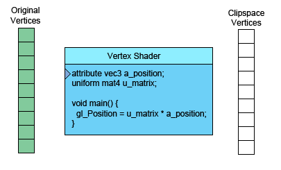

# WebGL How it Works

The GPU and WebGL at a basic level go through 2 process:
- The first part processes vertices (or streams of data) into clip space vertices;
- The second part draws pixels based on the first part.

When you call
```
var primitiveType = gl.TRIANGLES;
var offset = 0;
var count = 9;
gl.drawArrays(primitiveType, offset, count);
```
The 9 there means "process 9 vertices" so here are 9 vertices being processed.



On the the left is the data you provide. The vertex shader is a function you write in GLSL. It gets called once for each vertex. You do some math and set the special variable `gl_Position` with a clip space value for the current vertex. The GPU takes that value and stores it internally.

Assuming you're drawing `TRIANGLE`, every time this first part generate 3 vertices the GPU uses them to make a triangle. It figures out which pixels the 3 points of the triangle correspond to, and then rasterizes the triangle which is a fancy word for "draws it with pixels". For each pixel it will call your fragment shader asking you what color to make that pixel. Your fragment shader has to set a special variable `gl_FragColor` with the color it wants for that pixel.

To pass more info to the fragment shader, define "varyings" for each value we want to pass from the vertex shader to the fragment shader.

As a simple example, let's just pass the clip space coordinates we ccomputed directly from the vertex shader to the fragment shader.
```
// Fill the buffer with the values that define a triangle.
function setGeometry(gl) {
    gl.bufferData(
        gl.ARRAY_BUFFER,
        new Float32Array([
            0, -100,
          150,  125,
         -175,  100]),
        gl.STATIC_DRAW);
}
```
And we have to only draw 3 vertices.
```
// Draw the scene.
function drawScene() {
    ...
    // Draw the geometry.
    var primitiveType = gl.TRIANGLES;
    var offset = 0;
    var count = 3;
    gl.drawArrays(primitiveType, offset, count);
}
```
Then in our vertex shader we declare a *varying* pass data to the fragment shader.
```
varying vec4 v_color;
...
void main() {
    // Multiply the position by the matrix.
    gl_Position = vec4((u_matrix = vec3(a_position, 1)).xy, 0, 1);

    // Convert from clip space to color space.
    // Clip space goes -1.0 to +1.0
    // Color space goes from 0.0 to 1.0
    v_color = gl_Position * 0.5 + 0.5;
}
```
And then we declare the same *varying* in the fragment shader.
```
precision mediump float;

varying vec4 v_color;

void main() {
    gl_FragColor = v_color;
}
```
WebGL will connect the varying in the vertex shader to the varying of the same name and type in the fragment shader.

In the **triangleSlider.html**, you can move, scale and rotate the triangle, but the colors are computed from clip space they don't move with the triangle. They are relative to the background.

Our vertex shader, in this example, only gets called 3 times therefore it's only computing 3 colors yet our triangle is many colors, this technique is called *varying*.

WebGL takes the 3 values we computed for each vertex and as it rasterizes the triangle it interpolates between the values we computed for the vertices. For each pixel it calls our fragment shader with the interpolated value for that pixel. 

In the example quoted we start out with the 3 vertices

|      |     |
|------|-----|
|   0  |-100 | 
| 150  | 125 |
| -175 | 100 |
*Table 1:Vertices*

Our vertex shader applies a matrix to translate, rotate, scale and convert to clip space. The defaults for translation, rotation and scale are `translation = 200`, `150`, `rotation = 0`, `scale = 1`,`1`, so that's really only translation. given our backbuffer is `400x300` our vertex shader applies the matrix and then computes the following 3 clip space vertices.

|       |       |
|-------|-------|
| 0.000 |  0.660|
| 0.750 | -0.830|
|-0.875 | -0.660|
*Table 2: values written to gl_Position*

It also converts those to color space and writes them to the *varying* `v_color` that we declared.

|       |       |       |
|-------|-------|-------|
|0.5000 | 0.830 | 0.5   |
|0.8750 | 0.086 | 0.5   |
|0.0625 | 0.170 | 0.5   |
*Table 3: values written to v_color*

Those 3 values written to `v_color`are then interpolated and passed to the fragment shader for each pixel.

**See the animation in:** https://webglfundamentals.org/webgl/lessons/webgl-how-it-works.html

We can also pass in more data to the vertex shader which we can then pass on to the fragment shader. So for example let's draw a rectangle, that consist of 2 triangles, in 2 colors. To do this we'll add another attribute to the vertex shader so we can pass it more data and we'll pass that data directly to the fragment shader.
```
attribute vec2 a_position;
attribute vec4 a_color;
...
varying vec4 v_color;

void main() {
    ...
    // Copy the color from the attribute to the varying.
    v_color = a_color;
}
```
We now have to supply colors for WebGL to use.
```
// look up where the vertex data needs to go.
var positionLocation = gl.getAttribLocation(program, "a_position");
var colorLocation = gl.getAttribLocation(program, "a_color");
...
// Create a buffer for the colors.
var colorBuffer = gl.createBuffer();
gl.bindBuffer(gl.ARRAY_BUFFER, colorBuffer);
// Set the colors.
setColors(gl);
...
// Fill the buffer with colors for the 2 triangles
// that makes the rectangle.
function setColors(gl) {
    // Pick 2 random colors.
    var r1 = Math.random();
    var b1 = Math.random();
    var g1 = Math.random();

    var r2 = Math.random();
    var b2 = Math.random();
    var g2 = Math.random();

    gl.bufferData(
        gl.ARRAY_BUFFER,
        new Float32Array(
            [ r1, b1, g1, 1,
              r1, b1, g1, 1,
              r1, b1, g1, 1,
              r2, b2, g2, 1,
              r2, b2, g2, 1,
              r2, b2, g2, 1]),
        gl.STATIC_DRAW);
}
```
At render time setup the color attribute
```
gl.enableVertexAttribArray(colorLocation);

// Bind the color buffer.
gl.bindBuffer(gl.ARRAY_BUFFER, colorBuffer);

// Tell the color attribute how to get data out of colorBuffer (ARRAY_BUFFER)
var size = 4;           // 4 components per iteration
var type = gl.FLOAT;    // the data is 32bit floats
var normalize = false;  // don't normalize the data
var stride = 0;         // 0 = move forward size * sizeof(type) 
                        // each iteration to get the next position

var offset = 0;         // start at the beginning of the buffer
gl.vartexAttribPointer(
    colorLocation, size, type, normalize, stride, offset);
```
And adjust the count to compute 6 vertices for 2 triangles
```
// Draw the geometry.
var primitiveType = gl.TRIANGLES;
var offset = 0;
var count = 6;
gl.drawArrays(primitiveType, offset, count);
```
If you want more random the colors those appear in the triangle, change the interpolation.
```
// Fill the buffer with colors for the 2 triangles 
// that make the rectangle.
function setColors(gl) {
    // Make every vertex a diferent color.
    gl.bufferData(
        gl.ARRAY_BUFFER,
        new Float32Array(
            [ Math.random(), Math.random(), Math.random(), 1,
              Math.random(), Math.random(), Math.random(), 1,
              Math.random(), Math.random(), Math.random(), 1,
              Math.random(), Math.random(), Math.random(), 1,
              Math.random(), Math.random(), Math.random(), 1,
              Math.random(), Math.random(), Math.random(), 1]),
        gl.STATIC_DRAW);
}
```
See the codes: **rectangleTwoColorsRandom.html** and **rectangleMoreRandom.html**

<h1>Buffers and attributes commands' functions</h1>

Buffers are the way of getting vertex and other per vertex data onto the GPU. `gl.createBuffer` creates a buffer. `gl.bindBuffer`sets that buffer as the buffer to be worked on. `gl.bufferData` copies data into the buffer. This is usually done at initialization time.

Once the data the data is in the buffer we need to tell WebGL how to get data out of it and provide it to the vertex shader's attributes.

To do this, first we ask WebGL what locations it assigned to the attributes. In the examples given we have
```
// look up where the vertex data needs to go.
var positionLocation = gl.getAttribLocation(program, "a_position");
var colorLocation = gl.getAttribLocation(program, "a_color");
```
This is also usually done at initialization time.

Once we know the location of the attribute we then issue 3 commans just before drawing.

`gl.enableVertexAttribArray(location);`

That command binds a buffer to the `ARRAY_BUFFER` bind point. It's a global variable internal to WebGL

```
gl.vertexAttribPointer(
    location,
    numComponents,
    typeOfData,
    normalizeFlag,
    strideToNextPieceOfData,
    offsetIntoBuffer);
```
And that command tells WebGL to get data from the buffer that is currently bound to the `ARRAY_BUFFER` bind point, how many components per vertex (1 - 4), what the type of data is (`BYTE`, `FLOAT`, `INT`, `UNSIGNED_SHORT`, etc...), the stride which means how many bytes to skip to get from one piece of data to the next piece of data, and an offset for how far into the buffer our data is.

Number of components is always 1 to 4.

If you are using 1 buffer per type of data then both stride and offset can alway be 0. 0 for `stride` means "use stride that matches the type and size". 0 for `offset` means start at the beginning of the buffer. Setting them to values other than 0 is more complicated and though it has some benefits in terms of perfomance it's not worth the complication unless you are trying to push WebGL to its absolute limits.

<h1>What's normalizeFlag for in vertexAttribPointer?</h1>

The normalize flag is for all the non floating point types. If you pass in false then values will be interpreted as the type they are. `BYTE`goes from -128 to 127, `UNSIGNED_BYTE` goes from 0 to 255, `SHORT` goes from -32768 to 32767 etc...

If you set the normalize flag to true then the values of a `BYTE` (-128 to 127) represent the values -1.0 to +1.0, `UNSIGNED_BYTE` (0 to 255) became 0.0 to +1.0. A normalized `SHORT`also goes from -1.0 to +1.0 it just has more resolution than a `BYTE`.

The most common use for normalized data is for colors. Most of the time colors only go from 0.0 to 1.0. Using a full float each for red, green, blue and alph would use 16 bytes per vertex per color. If you have complicated geometry that can add up to a lot of bytes. Instead you could convert your colors to `UNSIGNED_BYTE`s where 0 represents 0.0 and 255 represents 1.0. Now you'd only need 4 bytes per color per vertex, a 75% savings.

Let's change our code to do this. When we tell WebGL how to extract our colors we'd use
```
// Tell the color attribute how to get data out of colorBuffer (ARRAY_BUFFER)
var size = 4;                   // 4 components per iteration
var type = gl.UNSIGNED_BYTE;    // the data is 8bit unsigned bytes
var normalize = true;          // normalize the data
var stride = 0;         // 0 = move forward size * sizeof(type) 
                        // each iteration to get the next position

var offset = 0;         // start at the beginning of the buffer
gl.vartexAttribPointer(
    colorLocation, size, type, normalize, stride, offset);
```
And then we fill out our buffer with colors we'd use
```
// Fill the buffer with colors for the 2 triangles
// that makes the rectangle.
function setColors(gl) {
    // Pick 2 random colors.
    var r1 = Math.random() * 256; // 0 to 255.99999
    var b1 = Math.random() * 256; // these values
    var g1 = Math.random() * 256; // will be truncated  
 
    var r2 = Math.random() * 256; // when stored in the
    var b2 = Math.random() * 256; // Uint8Array
    var g2 = Math.random() * 256;

    gl.bufferData(
        gl.ARRAY_BUFFER,
        new Uint8Array(     // Uint8Array
            [ r1, b1, g1, 255,
              r1, b1, g1, 255,
              r1, b1, g1, 255,
              r2, b2, g2, 255,
              r2, b2, g2, 255,
              r2, b2, g2, 255]);
        gl.STATIC_DRAW);
}
```
See: **rectangleTwoColorsRandom2.html***

