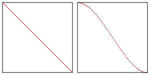

# WebGL 3D - Spot Lighting

In **point.md** we covered point lighting where for every point on the surface of our object we compute the direction from the light to that point on the surface. We then do the same thing we did for **directional.md** which is we took the dot product of the surface normal (the direction the surface is facing) and the light direction. This gave us a value of 1 if the two directions matched and should therefore be fully lit. 0 if the two directions were perpendicular and -1 if ther were opposite. We used that value directly to multiply the color of the surface which gave us lighting.

Spot lighting is only a very small change. In fact if you think creatively about the stuff we've done so far you might be able to derive your own solution. You can imagine a point light as a point with light going in all directions from that point. To make a spot light all we need to do is choose a direction from that point, this is the direction of our spotlight. Then, for every direction the light is going we could take the dot product of that direction with our chosen spotlight direction. We'd pick some arbitrary limit and decide if we're within that limit we light. If we're not within that limit we don't light.

Let's say the limit is 20 degrees. We can convert that to radians and from that to value for -1 to 1 by taking the cosine. Let's call that dot space. In other words here's a small table for limit values
```
        limits in
 degrees | radians | dot space
 --------+---------+----------
    0    |   0.0   |    1.0
    22   |    .38  |     .93
    45   |    .79  |     .71
    67   |   1.17  |     .39
    90   |   1.57  |    0.0
   180   |   3.14  |   -1.0
```
The we can the just check
```
dotFromDirection = dot(surfaceToLight, -lightDirection)
if (dotFromDirection >= limitInDotSpace) {
    // do the lighting
}
```
Let's do that

First let's modify our fragment shader from **fPoint*.html**.
```
precision mediump float;

// Passed in from the vertex shader.
varying vec3 v_normal;
varying vec3 v_surfaceToLight;
varying vec3 v_surfaceToView;

uniform vec4 u_color;
uniform float u_shininess;
uniform vec3 u_lightDirection;
uniform float u_limit;          // in dot space

void main() {
    // because v_normal is a varying it's interpolated,
    // it will not be a uint vector. Normalizing it
    // will make it a unit vector again
    vec3 normal == normalize(v_normal);

    vec3 surfaceToLightDirection = normalize(v_surfaceToLight);
    vec3 surfaceToViewDirection = normalize(v_surfaceToView);
    vec3 halfVector = normalize(surfaceToLightDirection + surfaceToViewDirection);

    float light = 0.0;
    float specular = 0.0;

    float dotFromDirection = dot(surfaceToLightDirection, -u_lightDirection);
    if (dotFromDirection >= u_limit) {
        light = dot(normal, surfaceToLightDirection);
        if (light > 0.0) {
            specular = pow(dot(normal, halfVector), u_shininess);
        }
    }

    gl_FragColor = u_color;

    // Let's multiply just the color portion (not the alpha)
    // by the light
    gl_FragColor.rgb *= light;

    // Just add in the specular
    gl_FragColor.rgb += specular;
}
```
Of course we need to look up the locations of the uniforms we just added.
```
var lightDirection = [?, ?, ?];
var limit = degToRad(20);

...

var lightDirectionLocation = gl.getUniformLocation(program, "u_lightDirection");
var limitLocation = gl.getUniformLocation(program, "u_limit");
```
and we need to set them
```
gl.uniform3fv(lightDirectionLocation, lightDirection);
gl.uniform1f(limitLocation, Math.cos(limit));
```
A few thing to note in **fSpot.html** are: One is we're negating `u_lightDirection` above. That's a [six of one, half dozen of another](https://en.wiktionary.org/wiki/six_of_one,_half_a_dozen_of_the_other) type of thing. We want the 2 directions we're comparing to point in the same direction when they match. That means we need to compare the `surfaceToLightDirection` to the opposite of the spotlight direction. We could do this in many different ways. We could pass the negative direction when setting the uniform. This would be my 1st choice but I thought it would be less confusing to call the uniform `u_lightDirection` instead of `u_reverseLightDirection` or `u_negativeLightDirection`.

Another thing,  if you added a conditional the shader compiler would expand the code with lots of multiply by 0 and 1 here and there to make it so there were not any actual conditionals in the code. That meant adding conditionals could make your code explode into combinatorial expansions. There isn't sure if that's true anymore but let's get rid of the conditionals anyway just to show some techniques. 

There is a **GLSL** function called `step`. It takes 2 values and if the second value is greater than or equal the first it returns 1.0. Otherwise it returns 0. In JavaScript it will be like this
```
function step(a, b) {
    if (b >= a) {
        return 1;
    } else {
        return 0;
    }
}
```
Let's use `step` to get rid of the conditions
```
float dotFromDirection = dot(surfaceToLightDirection, -u_lightDirection);

// inLight will be 1 if we're inside the spotlight and 0 if not
float inLight = step(u_limit, dotFromDirection);
float light = inLight * dot(normal, surfaceToLightDirection);
float specular = inLight * pow(dot(normal, halfVector), u_shininess);
```
Visually nothing changes between **fSpot.html** to **fSpot1.html**, but one other thing is right now the spotlight is super harsh. We're either inside the spotlight or not and things just turn black.

To fix this we could use 2 limits instead of one, an inner limit and an outer limit. If we're inside the inner limit then use 1.0. If we're outside the outer limit then use 0.0. If we're between the inner limit and the outer limit then lerp between 1.0 and 0.0.

Here's one way we could do this
```
uniform float u_innerLimit;     // in dot space
uniform float u_outerLimit;     // in dot space
 
...
 
float dotFromDirection = dot(surfaceToLightDirection, -u_lightDirection);
float limitRange = u_innerLimit - u_outerLimit;
float inLight = clamp((dotFromDirection - u_outerLimit) / limitRange, 0.0, 1.0);
float light = inLight * dot(normal, surfaceToLightDirection);
float specular = inLight * pow(dot(normal, halfVector), u_shininess);
```
After those changes, we're getting something that looks more like a spotlight as we can see in **fSpot.html**.

One thing to be aware of is if  `u_innerLimit` is equal to `u_outerLimit` then `limitRange` will be 0.0. We divide by `limitRange` and dividing by zero is bad/undefined. There's nothing to do in the shader here we just need to make sure in our JavaScript that `u_innerLimit` is never equal to `u_outerLimit`. (note: the **fSpot** code does not do this).

**GLSL** also has a function we could use to slightly simplify this. It's called `smoothstep` and like `step` it returns a value from 0 to 1 but it takes both an lower and upper bound and lerps between 0 and 1 between those bounds.
```
smoothstep(lowerBound, upperBound, value)
```
Let's do that
```
float dotFromDirection = dot(surfaceToLightDirection, -u_lightDirection);
float inLight = smoothstep(u_outerLimit, u_innerLimit, dotFromDirection); 
float light = inLight * dot(normal, surfaceToLightDirection);
float specular = inLight * pow(dot(normal, halfVector), u_shininess);
```

The difference is `smoothstep` uses a Hermite interpolation instead of a linear interpolation. That means between `lowerBound` and `upperBound` it interpolates like the image below on the right whereas a linear interpolation is like the image on the left.



One other thing to be aware is the `smoothstep` function has undefined results if the `lowerBound` is greater than or equal to `upperBound`. Having them be equal is the same issue we had above. The added issue of not being defined if `lowerBound` is greater than `upperBound` is new but for the purpose of a spotlight that should never be true.

## Be Aware Of Undefined Behavior In **GLSL**

Several functions in **GLSL** are undefined for certain values. Trying to raise a negative number to a power with `pow` is one example since the result would be an imaginary number. We went over another example above with `smoothstep`.

You need to try to be aware of these or else your shaders will get different results on different machines. **The spec, in section 8** (In the OpenGL's book) lists all the built in functions, what they do, and if there is any undefined behavior.

Here's a list of undefined behaviors. Note `genType` means `float`, `vec2`, `vec3`, or `vec4.`
```
genType asin (genType x)
```
Arc sine. Returns an angle whose sine is x. The range of values returned by this function is `[−π/2, π/2]` Results are undefined if `∣x∣ > 1`.
```
genType acos (genType x)
```
Arc cosine. Returns an angle whose cosine is x. The range of values returned by this function is `[0, π]`. Results are undefined if `∣x∣ > 1`.
```
genType atan (genType y, genType x)
```
Arc tangent. Returns an angle whose tangent is `y/x`. The signs of x and y are used to determine what quadrant the angle is in. The range of values returned by this function is `[−π,π]`. Results are undefined if x and y are both 0.
```
genType pow (genType x, genType y)
```
Returns x raised to the y power, i.e., xy. Results are undefined if `x < 0`. Results are undefined if `x = 0 and y <= 0`.
```
genType log (genType x)
```
Returns the natural logarithm of x, i.e., returns the value y which satisfies the equation `x = ey`. Results are undefined if `x <= 0`.
```
genType log2 (genType x)
```
Returns the base 2 logarithm of x, i.e., returns the value y which satisfies the equation `x=2y`. Results are undefined if `x <= 0`.
```
genType sqrt (genType x)
```
Returns √x . Results are undefined if `x < 0`.
```
genType inversesqrt (genType x)
```
Returns 1/√x. Results are undefined if `x <= 0`.
```
genType clamp (genType x, genType minVal, genType maxVal)
genType clamp (genType x, float minVal, float maxVal)
```
Returns `min (max (x, minVal), maxVal)`. Results are undefined if `minVal > maxVal`
```
genType smoothstep (genType edge0, genType edge1, genType x)
genType smoothstep (float edge0, float edge1, genType x)
```
Returns 0.0 if `x <= edge0` and 1.0 if `x >= edge1` and performs smooth Hermite interpolation between 0 and 1 when `edge0 < x < edge1`. This is useful in cases where you would want a threshold function with a smooth transition. This is equivalent to:
```
genType t;
t = clamp ((x – edge0) / (edge1 – edge0), 0, 1);
return t * t * (3 – 2 * t);
```
Results are undefined if `edge0 >= edge1`.