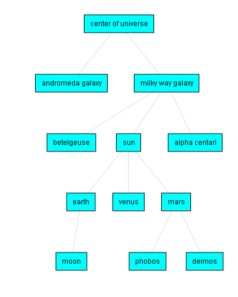
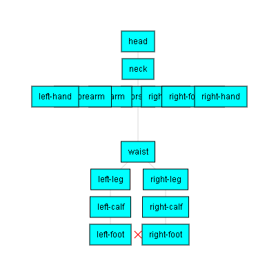

# WebGL - Scene Graph
 
 Most 3D engines use a scene graph. You put the things you want to appear in the scene graph. The engine then walks the scene graph and figures out a list of things to draw. Scene graphs are hierarchical so for example if you wanted to make a universe simulation you might have a graph that looks like this

 

 The first feature of a scene graph is it provides a parent child relationship for matrices as was discussed in **2DMatrices.md**. So for example in a simple (but unrealistic) universe simulation the stars (children), move along with their galaxy (parent). Similarly a moon (child) moves along with its planet (parent). If you move the earth the moon will move with it. If you move a galaxy all the stars inside will move with it. A scene graph provides a structure to help decide what matrix math to apply to an object.

 Typically each `Node` in a scene graph represents a *local space*. Given the correct matrix math anything in that *local space* can ignore everything above it. Another way to state the same thing is that the moon only has to care about orbiting the earth. It does not have to care about orbiting the sun. Without this scene graph structure you'd have to do much more complex math to compute how to get the moon to orbit the sun.

 With a scene graph you just make the moon a child of the earth and then orbit the earth which is simple. The scene graph takes care of the fact that the earth is orbiting the sun. It does this by walking the nodes and multiplying the matrices as it walks.
 ```
 worldMatrix = greatGrandParent * grandParent * parent * self(localMatrix)
 ```
 In concrete terms our universe simulation that would be
 ```
worldMatrixForMoon = galaxyMatrix * starMatrix * planetMatrix * moonMatrix;
```
We can do this very simply with a recursive function which is effectively
```
function computeWorldMatrix(currentNode, parentWorldMatrix) {
    // compute our world matrix by multiplying our local matrix with
    // our parent's world matrix.
    var worldMatrix = m4.multiply(parentWorldMatrix, currentNode.localMatrix);
 
    // now do the same for all of our children
    currentNode.children.forEach(function(child) {
        computeWorldMatrix(child, worldMatrix);
    });
}
```
This brings up some terminology which is pretty common to 3D scene graphs.

- `localMatrix`: The local matrix for the current node. It transforms it and its children in local space with itself at the origin.
- `worldMatrix`: For a given node it takes stuff in the local space of that node and transforms it to the space of the root node of the scene graph. Or in other words it in the world. If we compute the `worldMatrix` for the moon we'll get a funky orbit.

A scene graph is pretty easy to make. Let's define a simple `Node` object. There's a zillion ways to organize a scene graph and I'm not sure which way is best. The most common is to have an optional field of things to draw.
```
var node = {
   localMatrix: ...,  // the "local" matrix for this node
   worldMatrix: ...,  // the "world" matrix for this node
   children: [],      // array of children
   thingToDraw: ??,   // thing to draw at this node
};
```
Let's make a solar system scene graph. First let's make a few functions to help manage nodes. First we'll make a node class
```
var Node = function() {
    this.children = [];
    this.localMatrix = m4.identity();
    this.worldMatrix = m4.identity();
};
```
Let's give it a way to set the parent of a node
```
Node.prototype.setParent = function(parent) {
  // remove us from our parent
  if (this.parent) {
    var ndx = this.parent.children.indexOf(this);
    if (ndx >= 0) {
      this.parent.children.splice(ndx, 1);
    }
  }
 
  // Add us to our new parent
  if (parent) {
    parent.children.append(this);
  }
  this.parent = parent;
};
```
And here's the code to compute world matrices from local matrices based on their parent-child relationships. If we start at the parent and recursively visit the children we can compute their world matrices. 
```
Node.prototype.updateWorldMatrix = function(parentWorldMatrix) {
  if (parentWorldMatrix) {
    // a matrix was passed in so do the math and
    // store the result in `this.worldMatrix`.
    m4.multiply(this.localMatrix, parentWorldMatrix, this.worldMatrix);
  } else {
    // no matrix was passed in so just copy localMatrix to worldMatrix
    m4.copy(this.localMatrix, this.worldMatrix);
  }
 
  // now process all the children
  var worldMatrix = this.worldMatrix;
  this.children.forEach(function(child) {
    child.updateWorldMatrix(worldMatrix);
  });
};
```
Let's just do the sun, the earth, and the moon to keep it simple. We'll of course use fake distances so things fit on the screen. We'll just use a single sphere model and color it yellowish for the sun, blue-greenish for the earth and grayish for the moon. If `drawInfo`, `bufferInfo`, and `programInfo` are not familiar to you, see **draw.md**.
```
// Let's make all the nodes
var sunNode = new Node();
sunNode.localMatrix = m4.translation(0, 0, 0);  // sun at the center
sunNode.drawInfo = {
  uniforms: {
    u_colorOffset: [0.6, 0.6, 0, 1], // yellow
    u_colorMult:   [0.4, 0.4, 0, 1],
  },
  programInfo: programInfo,
  bufferInfo: sphereBufferInfo,
};
 
var earthNode = new Node();
earthNode.localMatrix = m4.translation(100, 0, 0);  // earth 100 units from the sun
earthNode.drawInfo = {
  uniforms: {
    u_colorOffset: [0.2, 0.5, 0.8, 1],  // blue-green
    u_colorMult:   [0.8, 0.5, 0.2, 1],
  },
  programInfo: programInfo,
  bufferInfo: sphereBufferInfo,
};
 
var moonNode = new Node();
moonNode.localMatrix = m4.translation(20, 0, 0);  // moon 20 units from the earth
moonNode.drawInfo = {
  uniforms: {
    u_colorOffset: [0.6, 0.6, 0.6, 1],  // gray
    u_colorMult:   [0.1, 0.1, 0.1, 1],
  },
  programInfo: programInfo,
  bufferInfo: sphereBufferInfo,
};
```
Now that we've made the nodes let's connect them.
```
// connect the celestial objects
moonNode.setParent(earthNode);
earthNode.setParent(sunNode);
```
We'll again make a list of objects and a list of objects to draw.
```
var objects = [
  sunNode,
  earthNode,
  moonNode,
];
 
var objectsToDraw = [
  sunNode.drawInfo,
  earthNode.drawInfo,
  moonNode.drawInfo,
];
```
At render time we'll update each object's local matrix by rotating it slightly.
```
// update the local matrices for each object.
m4.multiply(m4.yRotation(0.01), sunNode.localMatrix  , sunNode.localMatrix);
m4.multiply(m4.yRotation(0.01), earthNode.localMatrix, earthNode.localMatrix);
m4.multiply(m4.yRotation(0.01), moonNode.localMatrix , moonNode.localMatrix);
```
Now that the local matrices are updated we'll update all the world matrices
```
sunNode.updateWorldMatrix();
```
Finally now that we have world matrices we need to multiply those to get a `worldViewProjection` matrix for each object.
```
// Compute all the matrices for rendering
objects.forEach(function(object) {
  object.drawInfo.uniforms.u_matrix = m4.multiply(viewProjectionMatrix, object.worldMatrix);
});
```
Rendering is the same loop we saw in **draw.md**

To make the earth larger
```
// earth 100 units from the sun
earthNode.localMatrix = m4.translation(100, 0, 0);
// make the earth twice as large
earthNode.localMatrix = m4.scale(earthNode.localMatrix, 2, 2, 2);
```
But the moon must be smaller than the earth. To fix this we could manually shrink the moon. A better solution though is to add more nodes to our scene graph. Instead of just
```
  sun
   |
  earth
   |
  moon
```
We'll change it to
```
solarSystem
   |    |
   |   sun
   |
 earthOrbit
   |    |
   |  earth
   |
  moonOrbit
      |
     moon
```
This will let the earth rotate around the `solarSystem` but we can separately rotate and scale the sun and it won't affect the earth. Similarly the earth can rotate separately from the moon. 
```
var solarSystemNode = new Node();
var earthOrbitNode = new Node();
earthOrbitNode.localMatrix = m4.translation(100, 0, 0);  // earth orbit 100 units from the sun
var moonOrbitNode = new Node();
moonOrbitNode.localMatrix = m4.translation(20, 0, 0);  // moon 20 units from the earth
```
Those orbit distances have been removed from the old nodes
```
var earthNode = new Node();

earthNode.localMatrix = m4.scaling(2, 2, 2); // make the earth twice as large

var moonNode = new Node();
```
Connecting them now looks like this
```
// connect the celestial objects
sunNode.setParent(solarSystemNode);
earthOrbitNode.setParent(solarSystemNode);
earthNode.setParent(earthOrbitNode);
moonOrbitNode.setParent(earthOrbitNode);
moonNode.setParent(moonOrbitNode);
```
And we only need to update the orbit
```
// update the local matrices for each object.
m4.multiply(m4.yRotation(0.01), earthOrbitNode.localMatrix, earthOrbitNode.localMatrix);
m4.multiply(m4.yRotation(0.01), moonOrbitNode.localMatrix, moonOrbitNode.localMatrix);

// Update all world matrices in the scene graph
solarSystemNode.updateWorldMatrix();
```
And now, in **universe2.html**, you can see the earth is double size, the moon is not. You might also notice the sun and the earth are no longer rotating in place. That is now independent.

Let's adjust a few more things.
```
sunNode.localMatrix = m4.scaling(5, 5, 5);
 
...
 
moonNode.localMatrix = m4.scaling(0.4, 0.4, 0.4);
 
...
// update the local matrices for each object.
matrixMultiply(earthOrbitNode.localMatrix, m4.yRotation(0.01), earthOrbitNode.localMatrix);
matrixMultiply(moonOrbitNode.localMatrix, m4.yRotation(0.01), moonOrbitNode.localMatrix);
// spin the earth
m4.multiply(m4.yRotation(0.05), earthNode.localMatrix, earthNode.localMatrix);
// spin the moon
m4.multiply(m4.yRotation(-0.01), moonNode.localMatrix, moonNode.localMatrix);
```
Currently we have a `localMatrix` and we're modifying it each frame. There's a problem though in that every frame our math will collect a little bit of error. There is a way to fix the math which is called *ortho normalizing* a matrix but even that won't always work. For example let's imagine we scaled down zero and back. Let's just do that for one value `x`
```
x = 246;       // frame #0, x = 246
 
scale = 1;
x = x * scale  // frame #1, x = 246
 
scale = 0.5;
x = x * scale  // frame #2, x = 123
 
scale = 0;
x = x * scale  // frame #3, x = 0
 
scale = 0.5;
x = x * scale  // frame #4, x = 0  OOPS!
 
scale = 1;
x = x * scale  // frame #5, x = 0  OOPS!
```
We lost our value. We can fix this by adding some other class that updates the matrix from other values. Let's change the `Node` definition to have a `source`. If it exists we'll ask the `source` to give us a local matrix.
```
var Node = function(source) {
  this.children = [];
  this.localMatrix = m4.identity();
  this.worldMatrix = m4.identity();
  this.source = source;
};
 
Node.prototype.updateWorldMatrix = function(matrix) {
 
  var source = this.source;
  if (source) {
    source.getMatrix(this.localMatrix);
  }
 
  ...
```
Now we can create a source. A common source is one that provides translation, rotation, and scale something like this
```
var TRS = function() {
  this.translation = [0, 0, 0];
  this.rotation = [0, 0, 0];
  this.scale = [1, 1, 1];
};
 
TRS.prototype.getMatrix = function(dst) {
  dst = dst || new Float32Array(16);
  var t = this.translation;
  var r = this.rotation;
  var s = this.scale;
 
  // compute a matrix from translation, rotation, and scale
  m4.translation(t[0], t[1], t[2], dst);
  matrixMultiply(m4.xRotation(r[0]), dst, dst);
  matrixMultiply(m4.yRotation(r[1]), dst, dst);
  matrixMultiply(m4.zRotation(r[2]), dst, dst);
  matrixMultiply(m4.scaling(s[0], s[1], s[2]), dst, dst);
  return dst;
};
```
And we can use it like this
```
// at init time making a node with a source
var someTRS  = new TRS();
var someNode = new Node(someTRS);
 
// at render time
someTRS.rotation[2] += elapsedTime;
```
In the code above we are recreating the matrix each time.

Now let's do a animate human. How many joints you add for fingers and toes is up to you. The more joints you have the more power it takes to compute the animations and the more animation data it takes to provide info for all the joints. Old games like Virtua Fighter had around 15 joints. Games in the early to mid 2000s had 30 to 70 joints. If you did every joint in your hands there's at least 20 in each hand so just 2 hands is 40 joints. Many games that want to animate hands animate the thumb as one and the 4 fingers as one large finger to save on time (both CPU/GPU and artist time) and memory.



## SetParent vs AddChild / RemoveChild

Many scene graphs have a `node.addChild` function and a `node.removeChild` function whereas above I made a `node.setParent` function. Which way is better is arguably a matter of style but I'd argue one objectively better reason `setParent` is better than `addChild` is because it makes code like this impossible.
```
    someParent.addChild(someNode);
    ...
    someOtherParent.addChild(someNode);
```
What does that mean? Does `someNode` get added to both `someParent` and `someOtherParent`? In most scene graphs that's impossible. Does the second call generate an error? `ERROR: Already have parent`. Does it magically remove `someNode` from `someParent` before adding it to `someOtherParent`? If it does it's certainly not clear from the name `addChild`.

`setParent` on the other hand has no such issue
```
    someNode.setParent(someParent);
    ...
    someNode.setParent(someOtherParent);
```
It's 100% obvious what's happening in this case. Zero ambiguity.


