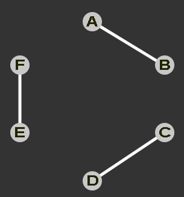
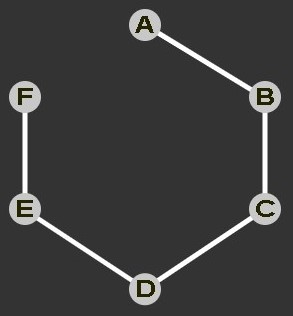
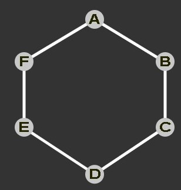
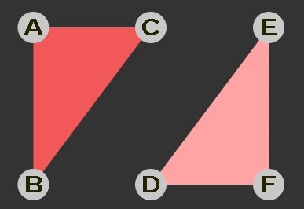
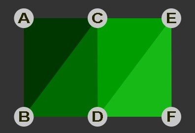
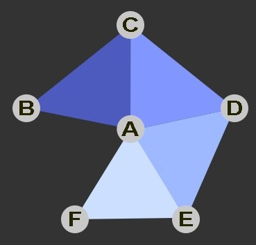

# WebGL Points, Lines, and Triangles

As mentioned in **fundamental.md** WebGL draws points, lines, and triangles. It does when we cal `gl.drawArrays` or `gl.drawElements`. We provide a vertex shader what outputs clip space coordinates and then, based on the first argument to `gl.drawArrays`or `gl.drawElements` WebGL will draw, points, lines, or triangles.

The valid values for the first argument to `gl.drawArrays`and `gl.drawElements` are:

`POINTS`: For each clip space vertex output by the vertex shader draw a square centered over that point. The size of the square is specified by setting a special variable `gl_PointSize` inside the vertex shader to the size we want for this square in pixels. 

Note: The maximum (and minimum) size that square can be is implementation dependent which you can query with

`const [minSize, maxSize] = gl.getParameter(gl.ALIASED_POINT_SIZE_RANGE);`

`LINES`: For each 2 clip space vertices output by the vertex shader draw a line connecting the 2 points. If we had points A, B, C, D, E, F then we'd get 3 lines.

The spce says we can set the thickness of this line by calling `gl.lineWidth` and specifying a width in pixels. In reality thought the maximum width is implementation dependent and for the majority of implementations the maximum width is 1. 

`const [minSize, maxSize] = gl.getParameter(gl.ALIASED_LINE_WIDTH_RANGE);`

This is mostly because values > 1 have been deprecated in core Desktop OpenGL.

`LINE_STRIP`: For each clip space vertex output by the vertex shader draw a line from the previous point output by the vertex shader.

So, if you output clip space vertices A, B, C, D, E, F you'll get 5 lines.

`LINE_LOOP`: This is the same as `LINE_STRIPE` example one more line is drawn from the last point to the first point.

`TRIANGLES`: For every 3 clip space vertices output by the vertex shader draw a triangle from 3 the 3 points this is the most used mode.

`TRIANGLE_STRIP`: For each clip space vertex output by the vertex shader draw a triangle from the last 3 vertices. In other words if you output 6 points A, B, C, D, E, F then 4 triangles will be drawn. A, B, C then B, C, D then C, D, E then D, E, F

`TRIANGLE_FAN`: For each clip space vertex output by the vertex shader draw a triangle from the first vertex and the last 2 vertices. In other words if you output 6 points A, B, C, D, E, F then 4 triangles will be drawn. A, B,C then A, C, D then A, D, E and finally A, E, F

According to the author, `TRIANGLE_FAN` and `TRIANGLE_STRIP` they fit only a few exceptional cases and the extra code for handling those cases is not worth just doing everything in triangles in the first place. In particular maybe you have tools to build normals or generate texture coordinates or do any other number of things with vertex data. By sticking to just `TRIANGLE` your functions will just work. As soon as you start adding in `TRIANGLE_FAN` and `TRIANGLE_STRIP` you need more functions to handle more cases.

Similarly `LINE_LOOP` and `LINE_STRIP`are not useful and have similar issues. Like `TRIANGLE_FAN` and `TRIANGLE_STRIP` the situations to use them are rare. For example you might think you want to draw 4 connected lines each made from 4 points.

If you use `LINE_STRIP` you'd need to make 4 calls to `gl.drawArrays` and more calls to setup the attributes for each line where as if you just use `LINES` then you can insert all the points needed to draw all 4 set of lines with a single call to `gl.drawArrays`.  That will be much much faster.

Further, `LINES`can be great to use for debugging or simple effects but given their 1 pixel width limit on most platforms it's often the wrong solution. If you want to draw a grid for a graph or show the outline of polygons in a 3d modeling program using `LINES` might be great but if you want to draw structured graphics like SVG or Adobe Illustrator the it won't work and you have to [render your lines some other way, usually from triangles.](https://mattdesl.svbtle.com/drawing-lines-is-hard)
