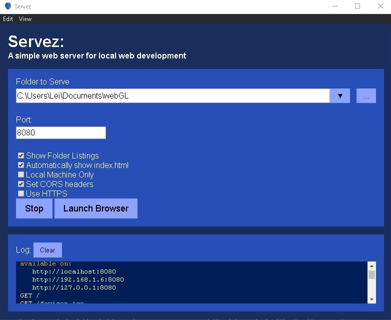

# Small WebServer

Using [servez](https://greggman.github.io/servez/), we can point it at the folder where the files is, click "Start", then go to your browser and type/copy `http://localhost:8080` or type/copy the address that the program generated. 

And voilá, we can see **processingImage.html**, **manipulateAnImage.html**, **showingAnImage.html**, **swappingImage.html**, and **un-blurredImage.html**.

